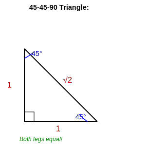
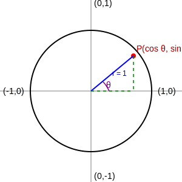
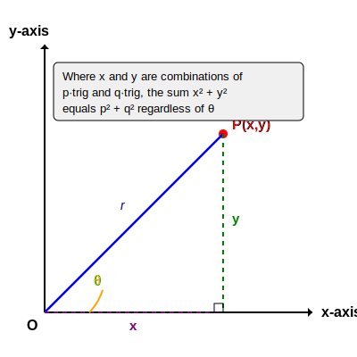
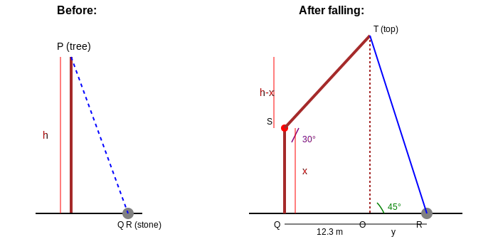
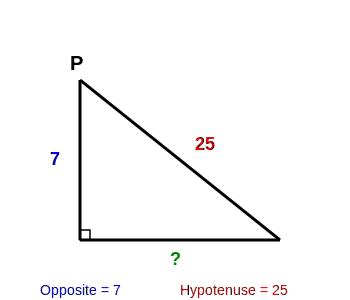
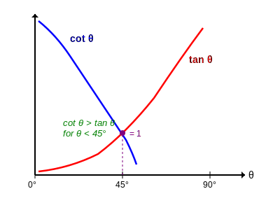
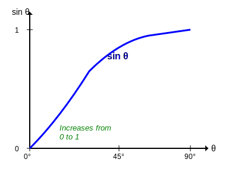
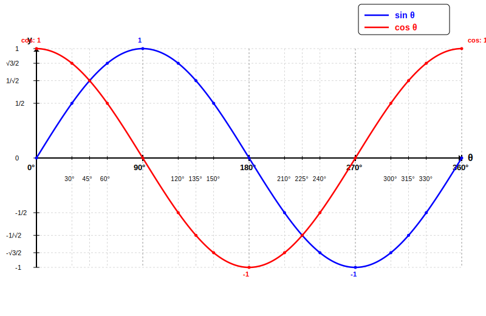

# Year 10 Trigonometry Revision Guide
**South Australian Curriculum**

---

## Table of Contents
1. [Greek Letters in Trigonometry](#greek-letters)
2. [Reciprocal Trigonometric Ratios](#reciprocal-ratios)
3. [Fundamental Trigonometric Identities](#fundamental-identities)
4. [Algebraic Manipulation with Trig Functions](#algebraic-manipulation)
5. [Pythagorean Identity Applications](#pythagorean-identity)
6. [Double Angle Formulas](#double-angle-formulas)
7. [Right Triangle Applications](#right-triangle-applications)
8. [Angle Comparison Rules](#angle-comparison)

---

## Quick Reference Table

| Identity Type | Formula |
|--------------|---------|
| **Pythagorean** | $\sin^2\theta + \cos^2\theta = 1$ |
| **Reciprocal - Sine** | $\operatorname{cosec} \theta = \frac{1}{\sin \theta}$ |
| **Reciprocal - Cosine** | $\sec \theta = \frac{1}{\cos \theta}$ |
| **Reciprocal - Tangent** | $\cot \theta = \frac{1}{\tan \theta}$ |
| **Quotient** | $\tan \theta = \frac{\sin \theta}{\cos \theta}$ |
| **Double Angle** | $\cos 2\theta = 1 - 2\sin^2\theta$ |
| **Right Triangle - Sine** | $\sin \theta = \frac{\text{Opp}}{\text{Hyp}}$ |
| **Right Triangle - Cosine** | $\cos \theta = \frac{\text{Adj}}{\text{Hyp}}$ |
| **Right Triangle - Tangent** | $\tan \theta = \frac{\text{Opp}}{\text{Adj}}$ |


### Special Angle Values

| Angle | sin | cos | tan |
|-------|-----|-----|-----|
| 0° | 0 | 1 | 0 |
| 30° | $\frac{1}{2}$ | $\frac{\sqrt{3}}{2}$ | $\frac{1}{\sqrt{3}}$ |
| 45° | $\frac{1}{\sqrt{2}}$ | $\frac{1}{\sqrt{2}}$ | 1 |
| 60° | $\frac{\sqrt{3}}{2}$ | $\frac{1}{2}$ | $\sqrt{3}$ |
| 90° | 1 | 0 | undefined |





## Greek Letters in Trigonometry {#greek-letters}

### Why Greek Letters?

Mathematicians use Greek letters to represent angles and other variables in trigonometry. This is a universal convention that helps distinguish angles from other quantities.

### Common Greek Letters for Angles

| Greek Letter | Name | Common Use |
|--------------|------|------------|
| $\theta$ | theta | Most common symbol for angles |
| $\alpha$ | alpha | First angle in a problem |
| $\beta$ | beta | Second angle in a problem |
| $\gamma$ | gamma | Third angle, or angle in coordinate geometry |
| $\phi$ | phi | Alternative angle symbol, phase angles |
| $\omega$ | omega | Angular velocity, circular motion |

**Theta ($\theta$)** is by far the most common letter you'll see. Most trigonometry problems use $\theta$ to represent the angle.

Examples:
- $\sin \theta$, $\cos \theta$, $\tan \theta$
- $\sin^2 \theta + \cos^2 \theta = 1$

### How to Write Them

Lowercase Greek Letters (angles):

| Greek Letter | Name  | Looks Like |
|--------------|-------|------------|
| θ            | theta | circle with a horizontal line|
| α            | alpha | curved "a"|
| β            | beta  | curly "B"|
| γ            | gamma | lowercase "y"|
| φ            | phi   | circle with a vertical line|
| ω            | omega | curly "w"|


### Practice Reading

When you see these expressions, read them as:

| Written | Read as |
|---------|---------|
| $\sin \theta$ | "sine theta" |
| $\cos \alpha$ | "cosine alpha" |
| $\tan \beta$ | "tangent beta" |
| $\theta = 30°$ | "theta equals 30 degrees" |
| $2\theta$ | "two theta" or "double theta" |

### In Context

Example problem notation:

```
"If sin θ = 3/5, find cos θ"
```

This is asking: "If sine of angle theta equals three-fifths, find the cosine of angle theta"

### Other Greek Letters You Might See

| Greek Letter | Name | Use in Math/Physics |
|--------------|------|---------------------|
| $\pi$ | pi | The constant ≈ 3.14159... |
| $\Delta$ | delta (capital) | "Change in" or difference |
| $\Sigma$ | sigma (capital) | Summation symbol |

**Note:** In Year 10, you'll primarily use **$\theta$ (theta)** for angles. The other letters become more important in Years 11-12 and university mathematics.

## 1. Reciprocal Trigonometric Ratios {#reciprocal-ratios}

### What are reciprocal ratios?

The three main reciprocal trigonometric ratios are:

**Cosecant (cosec)**: The reciprocal of sine

$$\operatorname{cosec} \theta = \frac{1}{\sin \theta}$$

**Secant (sec)**: The reciprocal of cosine

$$\sec \theta = \frac{1}{\cos \theta}$$

**Cotangent (cot)**: The reciprocal of tangent

$$\cot \theta = \frac{1}{\tan \theta} = \frac{\cos \theta}{\sin \theta}$$

### Example Application

**Given:** $3\operatorname{cosec} \theta = 9$

**Find:** $\sin \theta$

**Solution:**

$$\operatorname{cosec} \theta = \frac{9}{3} = 3$$

Since $\operatorname{cosec} \theta = \frac{1}{\sin \theta}$:

$$\sin \theta = \frac{1}{\operatorname{cosec} \theta} = \frac{1}{3}$$

### Key Tips
- Always remember: reciprocal means "flip the fraction"
- If you're given a cosec/sec/cot value, convert to sin/cos/tan first
- These are particularly useful when simplifying complex expressions

## Fundamental Trigonometric Identities {#fundamental-identities}

### The Pythagorean Identity

The most important identity you need to know:

$$\sin^2\theta + \cos^2\theta = 1$$



This can be rearranged to:

$$\sin^2\theta = 1 - \cos^2\theta$$

$$\cos^2\theta = 1 - \sin^2\theta$$

### Example Application

**Given:** $\sin X + \sin Y = 0$ and $\cos X + \cos Y = 1$

**Find:** $10\cos 2X + 3\cos 2Y$

**Solution:**

From the first equation: $\sin X = -\sin Y$

From the second equation: $\cos X = 1 - \cos Y$

Substitute into $\sin^2X + \cos^2X = 1$:

$$(-\sin Y)^2 + (1 - \cos Y)^2 = 1$$

$$\sin^2Y + 1 - 2\cos Y + \cos^2Y = 1$$

$$1 + 1 - 2\cos Y = 1$$

$$-2\cos Y = -1$$

$$\cos Y = \frac{1}{2}$$

### Other Important Identities

**Quotient Identities:**

$$\tan \theta = \frac{\sin \theta}{\cos \theta}$$

$$\cot \theta = \frac{\cos \theta}{\sin \theta}$$

**Reciprocal Identities:**

$$\sin \theta \times \operatorname{cosec} \theta = 1$$

$$\cos \theta \times \sec \theta = 1$$

$$\tan \theta \times \cot \theta = 1$$

## Algebraic Manipulation with Trig Functions {#algebraic-manipulation}

### Technique: Squaring Both Sides

When you have an equation like $\cos x + \sin x = \sqrt{2}$:

**Step 1:** Square both sides

$$(\cos x + \sin x)^2 = (\sqrt{2})^2$$

**Step 2:** Expand using $(a + b)^2 = a^2 + 2ab + b^2$

$$\cos^2x + 2\cos x \cdot \sin x + \sin^2x = 2$$

**Step 3:** Apply the Pythagorean identity $(\sin^2x + \cos^2x = 1)$

$$1 + 2\cos x \cdot \sin x = 2$$

$$2\cos x \cdot \sin x = 1$$

$$\cos x \cdot \sin x = \frac{1}{2}$$

### Technique: Expressing in Terms of One Function

**Example:** Find $\cot x + \tan x$ when $\cos x \cdot \sin x = \frac{1}{2}$

$$\cot x + \tan x = \frac{\cos x}{\sin x} + \frac{\sin x}{\cos x}$$

$$= \frac{\cos^2x + \sin^2x}{\sin x \cdot \cos x}$$

$$= \frac{1}{\sin x \cdot \cos x}$$

$$= \frac{1}{\frac{1}{2}} = 2$$

### Common Algebraic Patterns

1. **Difference of Squares:** $a^2 - b^2 = (a + b)(a - b)$

2. **Perfect Square:** $(a \pm b)^2 = a^2 \pm 2ab + b^2$

3. **Factoring:** Look for common factors in numerators and denominators

##  Pythagorean Identity Applications {#pythagorean-identity}

### Standard Form

$$\sin^2\theta + \cos^2\theta = 1$$

### Extended Application

**Example:** Simplify $\frac{\cos^4x - \sin^4x + 1}{5\cos^2x}$

**Step 1:** Recognize difference of squares in numerator

$$\cos^4x - \sin^4x = (\cos^2x)^2 - (\sin^2x)^2$$

$$= (\cos^2x + \sin^2x)(\cos^2x - \sin^2x)$$

$$= 1 \cdot (\cos^2x - \sin^2x)$$

$$= \cos^2x - \sin^2x$$

**Step 2:** Simplify the full expression

$$\cos^4x - \sin^4x + 1 = (\cos^2x - \sin^2x) + 1$$

$$= \cos^2x - \sin^2x + 1$$

$$= \cos^2x - (1 - \cos^2x) + 1$$

$$= \cos^2x - 1 + \cos^2x + 1$$

$$= 2\cos^2x$$

**Step 3:** Divide

$$\frac{2\cos^2x}{5\cos^2x} = \frac{2}{5}$$

### Using Parametric Forms

If $x = p \cos \theta + q \sin \theta$ and $y = p \sin \theta - q \cos \theta$:

$$x^2 = p^2\cos^2\theta + 2pq \cos \theta \sin \theta + q^2\sin^2\theta$$

$$y^2 = p^2\sin^2\theta - 2pq \sin \theta \cos \theta + q^2\cos^2\theta$$

Adding these:

$$x^2 + y^2 = p^2(\cos^2\theta + \sin^2\theta) + q^2(\sin^2\theta + \cos^2\theta)$$

$$= p^2(1) + q^2(1)$$

$$= p^2 + q^2$$



## Double Angle Formulas {#double-angle-formulas}

### The Key Formula

$$\cos 2\theta = 1 - 2\sin^2\theta$$

Alternative forms:

$$\cos 2\theta = 2\cos^2\theta - 1$$

$$\cos 2\theta = \cos^2\theta - \sin^2\theta$$

### Example Application

**Given:** $\sin X + \sin Y = 0$ and $\cos X + \cos Y = 1$

**Find:** $10\cos 2X + 3\cos 2Y$

**Solution:**

After finding $\cos X = \frac{1}{2}$ and $\cos Y = \frac{1}{2}$ (from previous work):

$$\cos 2X = 1 - 2\sin^2X = 1 - 2(1 - \cos^2X)$$

$$= 1 - 2\left(1 - \frac{1}{4}\right) = 1 - \frac{3}{2} = -\frac{1}{2}$$

$$\cos 2Y = 1 - 2\sin^2Y = 1 - 2\left(1 - \frac{1}{4}\right) = -\frac{1}{2}$$

Therefore:

$$10\cos 2X + 3\cos 2Y = 10\left(-\frac{1}{2}\right) + 3\left(-\frac{1}{2}\right)$$

$$= -5 - \frac{3}{2}$$

$$= -\frac{13}{2}$$

### Key Strategy
When you see $\cos 2\theta$ or $\sin 2\theta$, think about which double angle formula will help simplify the expression.

##  Right Triangle Applications {#right-triangle-applications}

### The Three Main Ratios

For a right triangle with angle θ:


$$\sin \theta = \frac{\text{Opposite}}{\text{Hypotenuse}}$$

$$\cos \theta = \frac{\text{Adjacent}}{\text{Hypotenuse}}$$

$$\tan \theta = \frac{\text{Opposite}}{\text{Adjacent}}$$

**Memory aid: SOH-CAH-TOA**

- **S**ine = **O**pposite/**H**ypotenuse
- **C**osine = **A**djacent/**H**ypotenuse
- **T**angent = **O**pposite/**A**djacent

### Problem-Solving Strategy

**Example:** A tree tied to a stone with a 21.3 m rope. The rope makes a 45° angle with the ground after the tree falls, creating a 30° angle at the break point.



**Step 1:** Draw a diagram showing all known information

**Step 2:** Identify the right triangles formed

**Step 3:** Use trigonometric ratios

For the 30° angle at the break:

$$\tan 30° = \frac{x}{12.3}$$

$$x = 12.3 \times \tan 30° = \frac{12.3}{\sqrt{3}} = 7.1 \text{ m}$$

**Step 4:** Find the tree height using sin

$$\sin 30° = \frac{x}{h - x}$$

$$\frac{1}{2} = \frac{7.1}{h - 7.1}$$

$$h - 7.1 = 14.2$$

$$h = 21.3 \text{ m}$$

**Step 5:** Use the 45° angle to find the final distance

$$\tan 45° = \frac{h}{12.3 + y}$$

$$1 = \frac{21.3}{12.3 + y}$$

$$12.3 + y = 21.3$$

$$y = 9 \text{ m}$$

### Pythagoras Theorem

Don't forget! For any right triangle:

$$c^2 = a^2 + b^2$$

where $c$ is the hypotenuse and $a$, $b$ are the other sides.

### Working Backwards from Ratios

**Given:** $\operatorname{cosec} P = \frac{25}{7}$, find $\sin P \times \cos R + \cos P \times \sin R$

**Step 1:** Convert to sin

$$\operatorname{cosec} P = \frac{25}{7}$$

$$\sin P = \frac{7}{25}$$

**Step 2:** Draw the triangle and find the missing side



$$\text{Adjacent}^2 = 25^2 - 7^2 = 625 - 49 = 576$$

$$\text{Adjacent} = 24$$

**Step 3:** Find the required ratios

$$\sin P = \frac{7}{25}$$

$$\cos P = \frac{24}{25}$$

##  Angle Comparison Rules {#angle-comparison}

### Key Relationships for 0° < θ < 45°

$$\cot \theta > \tan \theta$$

This is because:
- As $\theta \to 0°$, $\tan \theta \to 0$ and $\cot \theta \to \infty$
- At $\theta = 45°$, $\tan \theta = \cot \theta = 1$
- For $\theta < 45°$, $\cot \theta > 1$ and $\tan \theta < 1$



### Example Application

**Determine the sign of:** $\tan 38° - \cot 38°$

**Solution:**

Since $38° < 45°$:

$$\cot 38° > \tan 38°$$

Therefore:

$$\tan 38° - \cot 38° < 0 \text{ (negative)}$$

### Sine Function Behavior

Between 0° and 90°:

$$\sin 0° = 0$$
$$\sin 90° = 1$$



As $x$ increases from 0° to 90°, $\sin x$ increases from 0 to 1.

This means $\sin x$ is **monotonically increasing** in the first quadrant.

### Full Wave Pattern (0° to 360°)

For a complete understanding of sine and cosine behavior, here's the full wave pattern from 0° to 360°:



**Key observations:**

- **Sine** starts at 0, reaches maximum (1) at 90°, returns to 0 at 180°, reaches minimum (-1) at 270°, and returns to 0 at 360°
- **Cosine** starts at 1, reaches 0 at 90°, reaches minimum (-1) at 180°, returns to 0 at 270°, and returns to 1 at 360°
- Cosine is the same as sine **shifted 90° to the left**
- Both functions oscillate between -1 and 1
- Both functions repeat every 360° (this is called the **period**)

---

## Advanced Identity Manipulation

### Complex Identity Simplification

**Example:** Simplify $(\cos A - \operatorname{cosec} A)^2 + (\sin A - \sec A)^2$

**Step 1:** Expand both squares using $(a - b)^2 = a^2 - 2ab + b^2$

$$= \cos^2A - 2\cos A \cdot \operatorname{cosec} A + \operatorname{cosec}^2A$$

$$+ \sin^2A - 2\sin A \cdot \sec A + \sec^2A$$

**Step 2:** Group the Pythagorean pairs

$$= (\cos^2A + \sin^2A) + (\operatorname{cosec}^2A + \sec^2A)$$

$$- 2(\cos A \cdot \operatorname{cosec} A + \sin A \cdot \sec A)$$

**Step 3:** Simplify using identities

$$= 1 + \left(\frac{1}{\sin^2A} + \frac{1}{\cos^2A}\right) - 2\left(\frac{\cos A}{\sin A} + \frac{\sin A}{\cos A}\right)$$

$$= 1 + \frac{1}{\sin^2A \cdot \cos^2A} - \frac{2}{\sin A \cdot \cos A}$$

$$= \left(\frac{1}{\sin A \cdot \cos A} - 1\right)^2$$

$$= (\operatorname{cosec} A \cdot \sec A - 1)^2$$

## Practice Checklist

Before your exam, make sure you can:

- [ ] Convert between sin/cos/tan and their reciprocals
- [ ] Apply the Pythagorean identity $\sin^2\theta + \cos^2\theta = 1$
- [ ] Use double angle formulas confidently
- [ ] Solve right triangle problems with word problems
- [ ] Simplify complex trigonometric expressions
- [ ] Work with parametric equations involving trig functions
- [ ] Compare trig values for angles less than 45°
- [ ] Expand and factor trigonometric expressions


